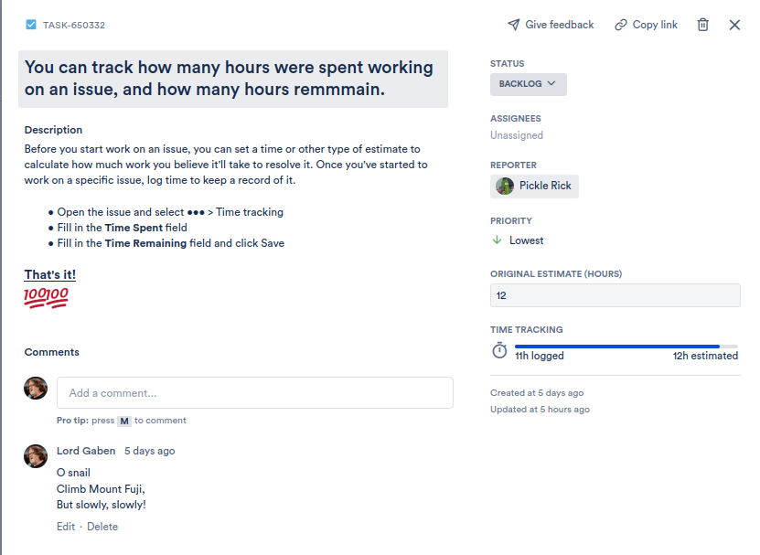
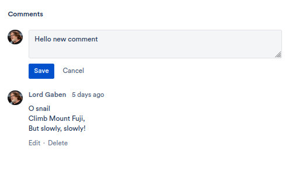
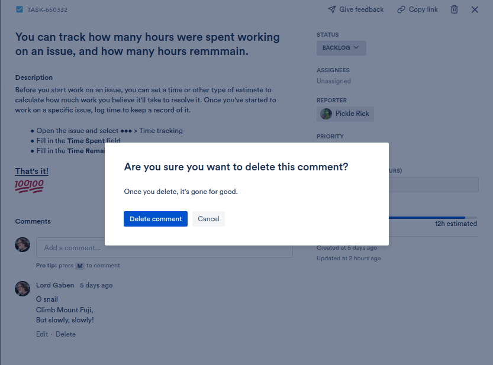

# Jira clone Backend 
# API Documentation

## Login 
## About 
### `GET /api/about` 


<br>
<br>

### Project's board (aka Home page for the project) 

#### `GET /api/{projectId}/board`


<br>

```diff
Parameters: 
    Path : projectId
    Body : None

Responses:
+ 200 (application/json)
    Attribute (Board)
- 404 Project not found
```

### Project 

* **Making changes** 
#### `PUT /api/projects/{projectId}`

 
 <br>
 <br>

```diff
Parameters:
    Path: projectId
    Body: 
        Project
            name	string
            description	string
            category	string
            url	string
Responses:
+  201 (application/json)
     Attribute (Project)
- 404 Project not found
- 405	Invalid input
```

<br>

### Issue

* **Issue Consulting**
#### `GET /api/projects/issues/{issueId}/`



<br>

```diff
Parameter:
    Path : issueId
Responses:
+ 200 (application/json)
    Attribute (Issue)
- 404 Issue doesn't exist


```
<br>

* **Issue Creation**
#### `POST /api/projects/{projectId}/issues/`


<br>

```diff
Parameters:
    Path: projectId
    Body: Issue
        title	         string
        type	         Type    
        status	         Status  
        priority         Priority
        listPosition	 integer
        description	     string
        descriptionText	 string
        estimate	     integer
        timeSepnt	     integer
        timeRemaining	 integer
        reporterId	     integer
        project	         Project
        projectId	     integer
        comments	     Comment[]
        users	         User[]
        userIds	         integer[]
Responses:
+ 200 (application/json)
    Attribute (Issue)
- 400 Something's wrong
- 405 Project's couldn't be saved
```
<br>

* **Issue Modification** 

#### `PATCH /api/projects/issues/{issueId}/`


<br>

```diff
Parameters:
    Path: issueId
    Body: Issue
Responses:
+ 201 (application/json)
     Attribute (Issue)
- 404: Issue doesn't exist
- 405: Something's wrong with the input

```

<br>

* **Issue Removal**
#### `DELETE /api/projects/issues/{issueId}/ `


<br>

```diff
Parameter:
    Path: issueId
Responses:
+ 200 Issue has been deleted
- 404 Issue doesn't exist
```
* **Issue Search** 

#### ` GET /api/projects/{projectId}/issues/search`


<br>

```diff
Parameter:
    Path: projectId
Responses
+ 200 (application/json)
     Attributes (array[Issues])
- 404 Project doesn't exist
```


### Comment
<br>

* **Commment Addition**

#### `POST /api/issues/{issueId}/comment `



<br>

```diff
Parameter:
    Path: issueId
    Body: Comment
        body	    string
        user	    User
        userId	    integer
        issue	    Issue
        issueId	    integer
Responses:
+ 200 (application/json)
     Attribute (Comment)
- 404 Issue doesn't exist
```

<br>

* **Commment Modification**


#### `PUT /api/issues/comments/{commentId} `


<br>

```diff
Parameters:
    Path: commentId
    Body: Comment
Responses:
+ 200 (application/json)
     Attributes (Comment)
- 404 Comment doesn't exist
- 405 Something went wrong

```


<br>

* **Comment Removal**


#### ` DELETE /api/issue/comment{commentId}`



<br>

```diff
Parameter:
    Path: commentId
Responses
+ 200 OK
- 404 Comment doesn't exist

```


