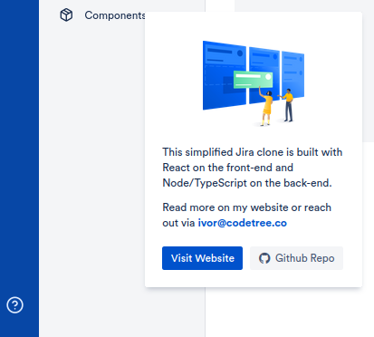
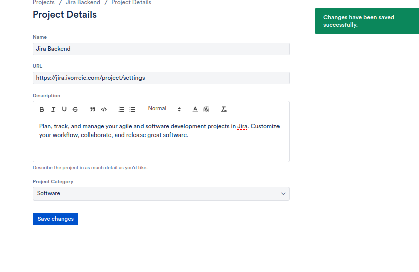
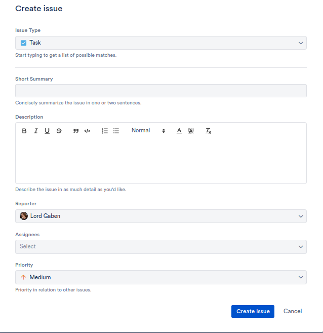
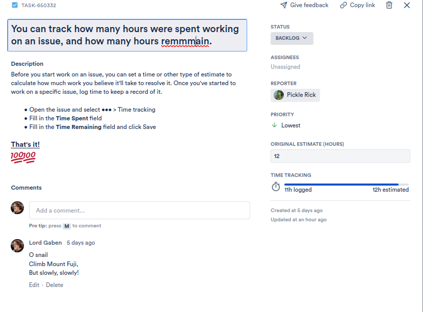
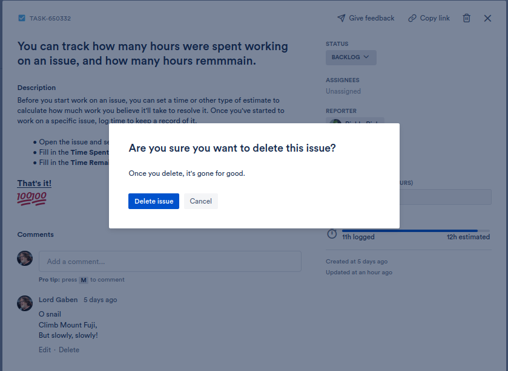
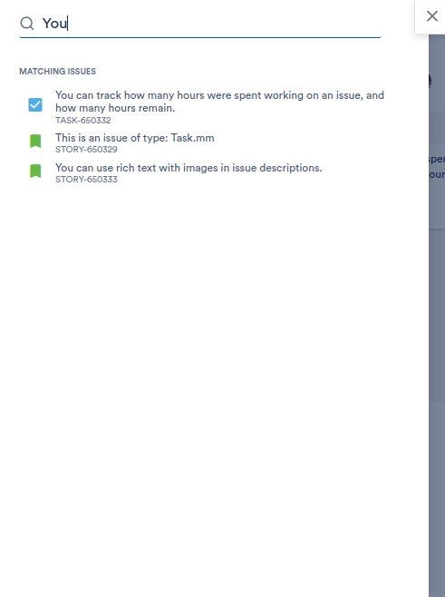

# Jira clone Backend 
# API Documentation

## Login 
## About 
### `GET /api/about` 

 
 

### Project's board (aka Home page for the project) 

#### `GET /api/{projectId}/board`

 
+ Response 200 (application/json)
    + Attribute (Board)
### Project 

* **Making changes** 
#### `PUT /api/projects/{projectId}`

 
  
  
+ Response 201 (application/json)
    + Attribute (Project)
 

### Issue

* **Issue Creation**
#### `POST /api/projects/{projectId}/issues/`

 
+ Response 200 (application/json)
    + Attribute (Issue)

* **Issue Modification** 
#### `PATCH /api/projects/issues/{issueId}/`

 
+ Response 201 (application/json)
    + Attribute (Issue)

* **Issue Removal**
#### `DELETE /api/projects/issues/{issueId}/ `

    

* **Issue Search** 
#### ` GET /api/projects/{projectId}/issues/search`

+ Response 200 (application/json)
    + Attributes (array[Issues])

